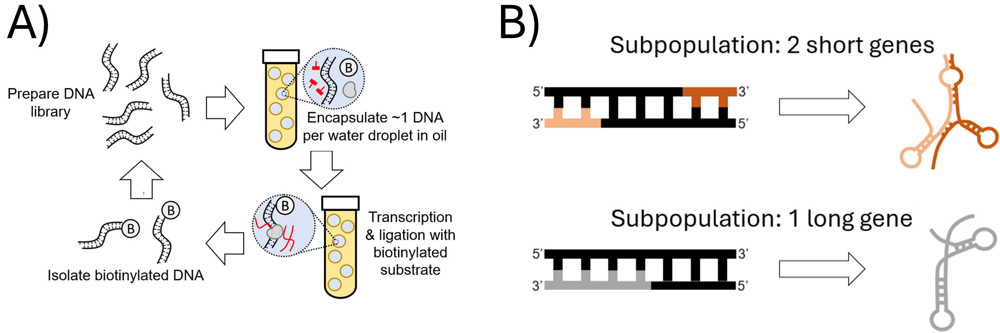

# Multi-subunit-ribozyme-selection

## Overview
This project assesses in vitro selection of ligase ribozymes and identifies promising ribozyme variants for empirical testing. This project assumes selection (Fig. 1A) from a mixed library of DNA templates encoding either 1 or 2 RNAs (Fig. 1B).


## Workflow

```
De-multiplexed FASTQ files → Quality control → Compute properties of the entire population and specific variants
```


1. **De-multiplexed FASTQ files:** Prepare seperate FASTQ files from each round of selection
2. **Quality Control:** Aptasuite parses paired-end reads using fuzzy matching to confirm primer regions are present, and automatically corrects mismatches between forward and reverse reads. Outputs .txt files containing redundant sequence entries that must be summed to get total read count
3. **Compute properties of the entire population:** Assess_variant_pool_from_selection.ipynb
4. **Compute properties of the pool encoding either 1 or 2 RNAs:** Assess_RNA_pool.ipynb


## Requirements

- Python 3.8+
- APTASUITE
- Required Python packages: `Biopython`, `pandas`, `numpy`


### Input Format
- **.txt files from APTASUITE:** Tab delimited files with the following headers: Aptamer  Id  Sequence	Round0	Round1	Round2  etc.

### Output Files
- `variants_sorted_by_enrichment.csv` - Properties of each variant including reads, enrichment, sequence, and sequence family ID

## Key Parameters

| Parameter | Default | Description |
|-----------|---------|-------------|
| `--read_threshold` | 1 | each variant must have more reads than the read threshold to be considered in the stated calculation |
| `--promoter_tolerance` | 2 | maximum edit distance to classify a substring as containing the T7 promoter |
| `--one_or_two_RNAs` | 1 or 2 | one_or_two_RNAs = choose whether you want to assess the 1 or 2 RNA pool |


## Important Notes

- **Note 1:** Labels must be adjusted depending on whether sequence data is available for each round of selection.

## Troubleshooting

**Problem 1** Certain blocks of code can be activated to output the status of calculations.


## References

- Hoinka, J., Backofen, R. and Przytycka, T. M. (2018). AptaSUITE: A Full-Featured Bioinformatics Framework for the Comprehensive Analysis of Aptamers from HT-SELEX Experiments. Molecular Therapy - Nucleic Acids, 11, 515–517.
